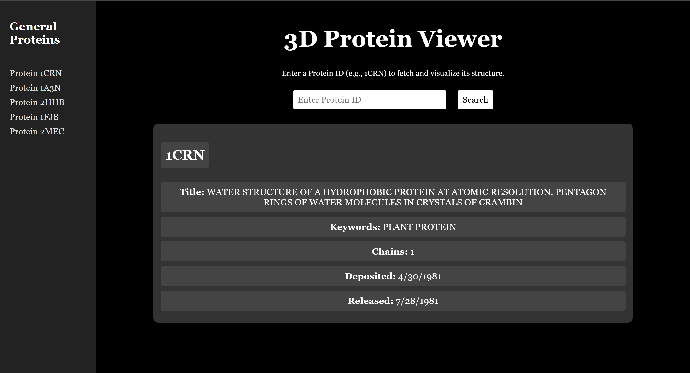
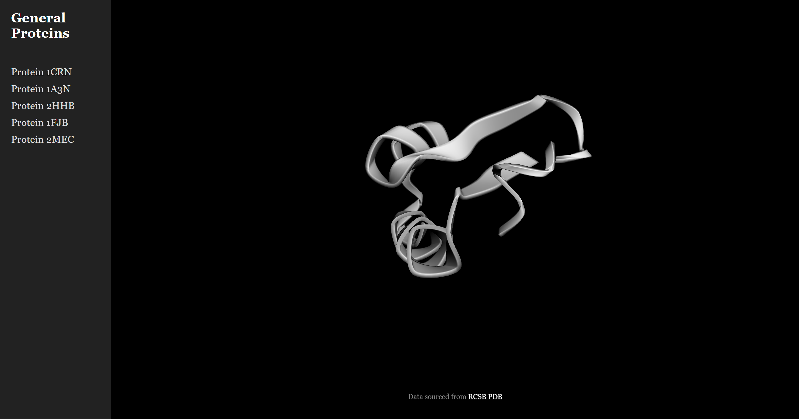

# Protein Viewer

**Protein Viewer** is a lightweight, open-source web tool for visualizing protein structures in 3D using PDB IDs.  
Built with 3Dmol.js and styled for simplicity, it fetches data live from the RCSB Protein Data Bank.

## 🔍 Features
- **3D Protein Model Viewer:** Renders interactive protein structures from valid PDB IDs using 3Dmol.js.

- **Live Protein Fetching:** Automatically loads and displays models from the RCSB Protein Data Bank.

- **Dark Mode Aesthetic:** Clean, modern black-themed UI for visual comfort and clarity.

- **Responsive Layout:** Works across devices and screen sizes with scroll-enabled content (without visible scrollbars).

- **Instant Load on Click:** Simply input a PDB ID and click "Load" to visualize instantly—no refresh required.

- **Open Source:** Fully open and modifiable under the MIT License.

## 📸 Screenshots

  
  
***Preview of the Model Loaded via PDB ID Input***

## 🛠 How to Use
1. Enter a valid PDB ID.
2. Click "Load Protein."
3. Interact with the 3D model.

## ⚙️ Tech Stack
- HTML
- CSS
- JavaScript
- [3Dmol.js](https://3dmol.org/)
- RCSB PDB API

## 🪪 License
This project is *open-source* under the MIT License.
